<div align="center">

# PerfectPixel

**An AI-powered animation sprite generation studio**

Turn a one-line character description into a base character, then auto-generate 100+ motion
animations (walk, run, attack, magic, …) and complete 8-direction sprite sets — exported in
formats your game engine can import directly.


**English** · [한국어](README.ko.md)

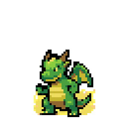

<sub>A power-up animation generated end-to-end by the actual pipeline (`gemini-3-pro-image`).</sub>

</div>

---

## Why this is a hard problem

Plenty of tools draw a pretty picture. Game developers need something else: a 6-frame walk
must be *exactly* 6 frames, every frame must read as the *same* character, the background must
be fully alpha-transparent, and the character's anchor must not jitter between frames — all in a
format an engine can import as-is.

AI models are bad at these constraints. Frame counts come out wrong, poses bleed into each
other, hair color drifts mid-strip (*identity drift*), and the chroma-key background spills
onto the character's silhouette.

**PerfectPixel's core idea: let the AI render, but enforce quality, consistency, and precision
with a deterministic post-processing pipeline.** Even when the AI's output is non-deterministic,
the result converges to a consistent quality bar. That is the engineering moat — see the
before/after comparisons below, all produced by the *real* pipeline code on *real* AI output.

## Features

- **Text → character**: describe a character, pick a style (pixel art, chibi, cartoon …), and
  generate a base character with the background auto-removed.
- **100+ motion presets**: a categorized keyword catalog — walk, run, jump, attack, magic,
  emotes, and more.
- **8-direction sets**: 5 directions are generated by AI and the 3 mirror directions are
  derived by horizontal mirroring, for a consistent set at **37.5% lower generation cost**.
- **Self-correcting quality loop**: generate → matte → extract → inspect → corrective
  regenerate, up to 3 passes, converging frame count and motion quality.
- **Real pixelization**: shared-palette quantization + pixel-grid snapping for authentic dot art.
- **Engine-friendly export**: sprite sheet + `manifest.json` + Aseprite-compatible JSON +
  per-state GIF/APNG + individual frame PNGs, all in one pass.
- **Multi-provider**: choose Gemini, OpenRouter, fal.ai, or BytePlus as the backend.
- **Sessions & gallery**: work state is persisted to disk and results are auto-archived.

## Sample Output

<div align="center">

| Walk | Idle | Cheer | Power Up |
|------|------|-------|----------|
| 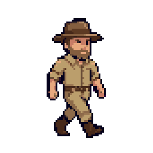 | 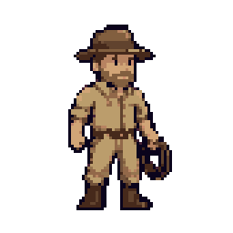 | 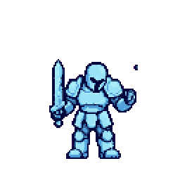 |  |
| Dance | Victory | Block | Low HP |
| 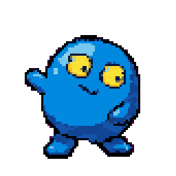 | 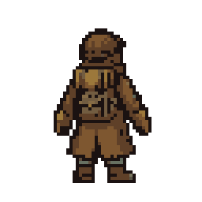 | 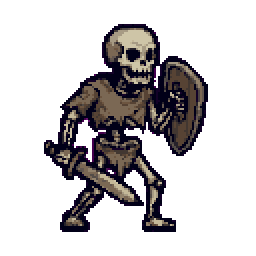 | 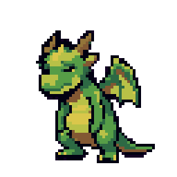 |

</div>

## How it works

Generating one state (animation) runs this pipeline in the Go backend:

```
description + style + motion preset
        │
        ▼
  build prompt ──► AI image generation (horizontal filmstrip)
        │
        ▼
  background detect & matte ──► frame extraction (cell segmentation)
        │
        ▼
  inspect (frame count / identity drift / motion presence)
        │
        ├─ pass ─────────────► pixel quantization ──► done
        │
        └─ fail ─► corrective retry hint ──► regenerate (up to 3×)
```

Two things make this more than a naive retry loop:

- **Best-candidate scoring** — every attempt is scored `score = Found*100 − errors*10`, and the
  best candidate is kept. A perfect result returns immediately; if 3 passes still aren't perfect,
  the best-so-far is returned (never an empty hand). API errors and cancellations bail early.
- **Measurement-driven retry hints** — defects detected during inspection are converted into
  precise English correction instructions injected into the next prompt (e.g. *"the previous
  result read as 7 poses but exactly 6 are required; split the canvas into 6 even columns…"*).
  Combined with user feedback, each pass becomes a **closed-loop self-correction** that converges
  on the defect rather than rolling the dice again.

---

## The engineering: deterministic correction

The design philosophy in one line: **signal processing, not heuristics.** Three signal-processing
axes — wrapped in a self-diagnostic, self-correcting closed loop.

### 1. Background removal — chrominance-based matting

Instead of thresholding RGB, colors are converted to **YCbCr** and the background is separated
using only the chrominance (Cb, Cr) components, discarding luma (Y). This treats shaded and
bright magenta as the same color, and is inherently robust to JPEG's 4:2:0 subsampling (which
preserves luma but crushes chrominance). The background key is estimated as the **mode of a CbCr
histogram** (not the mean, so gradients/noise don't shift it), sampled from the four corners
where the character rarely intrudes. Soft alpha matting uses a **Hermite smoothstep** for edge
feathering, **despill** projects out only the key-direction color spill (keeping the character's
own colors), and a **4-connectivity flood fill** clears residual background while preserving
isolated interior pixels (so the character never gets holes). A **self-diagnostic magenta
fallback** re-mattes with pure `#FF00FF` when opacity or magenta-residue metrics spike.

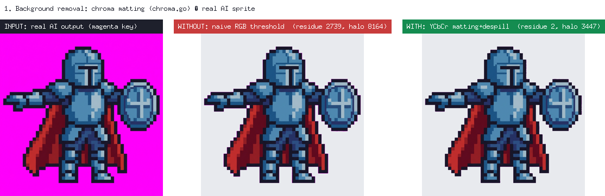

> **WITHOUT** (naive RGB threshold): 2,739px of magenta residue + 8,164px pink halo remain.
> **WITH** (YCbCr matting + despill + flood fill): 2px residue, 3,447px halo, character body
> (~456K opaque px) fully preserved.

### 2. Frame segmentation — projection profile + DP optimal cut

Asking for a "6-frame filmstrip" rarely yields 6 evenly spaced poses; gaps are uneven and arms
touch the neighbor. PerfectPixel borrows OCR's **projection-profile + optimal-cut** technique.
A **vertical alpha projection** `P[x] = Σ_y α(x,y)` makes inter-pose gutters appear as valleys;
after smoothing, content runs are counted as the *natural pose count*. When poses are fused and
the valley vanishes, **dynamic programming** finds the globally optimal `expected−1` cuts,
minimizing a cost of `Σ P[cut] + λ·(width − ideal)²`. Unlike greedy or connected-component
methods (which would fuse two touching poses into one blob), the DP cut finds the minimum-alpha
seam and splits *exactly* into the expected count, slicing through as little of the limbs as
possible.

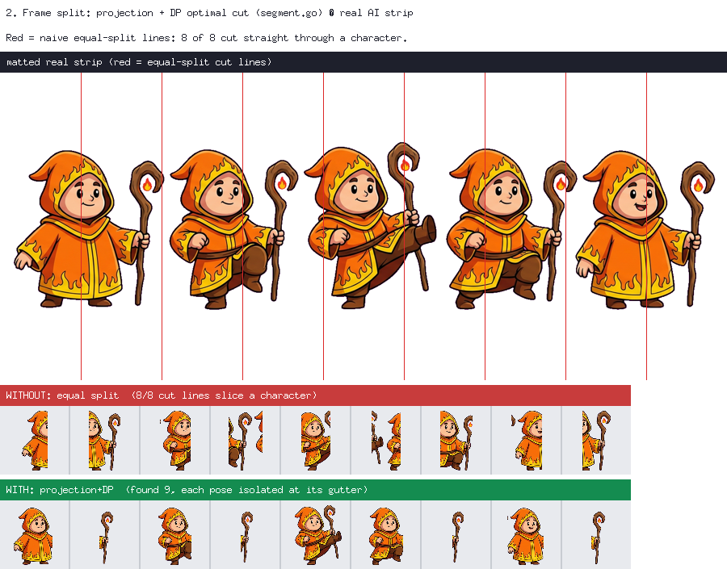

> Real fire-mage *kick* strip (9 frames). **WITHOUT** (equal split): all 8 cut lines slice
> straight through the characters. **WITH** (projection + DP): **0 cut lines cross a character**;
> all 9 poses separated intact.

### 3. Frame alignment — alpha-weighted centroid

When centering a pose in its cell, using the **bounding-box center** lets a pose with an
outstretched arm or weapon push the torso to the opposite side — so the character jitters
left/right during playback. Instead, the **alpha-weighted centroid** (center of mass,
`cx = Σ(x·α) / Σα`) is aligned to the cell center; the large torso dominates the centroid, so no
matter how the limbs extend, the torso stays put. A shared scale unifies character size
(downscale only, CatmullRom interpolation), and a baseline offset preserves jump arcs. This
deterministically guarantees the "rock-steady axis" feel that matters most for game sprites.

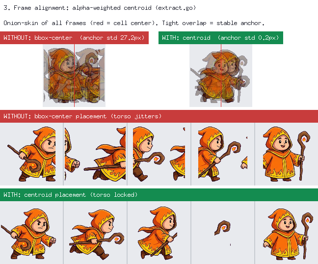

> Real fire-mage *dash* strip (5 frames). Onion-skin overlay; red line is the cell center.
> **WITHOUT** (bbox center): character drifts left/right (centroid σ = 27.2px).
> **WITH** (alpha-weighted centroid): pinned to center (σ = 0.2px — ~135× more stable).

### 4. Pixel-art post-processing — quantization + grid snap

AI "pixel art" isn't really pixel art — it's a high-res image with anti-aliasing and gradients
and thousands of colors. A **shared palette** is extracted across all frames via median-cut
(per-frame quantization would flicker), with a perceptually-weighted color distance
`2dr² + 4dg² + 3db²`. The real block size of the fake pixels is estimated from the mode of
same-color run lengths (an *unfake* technique), then **grid snap** fills each block with its
dominant color on a shared grid. Identity inspection runs *before* quantization, so drift
detection isn't dulled by the palette reduction.

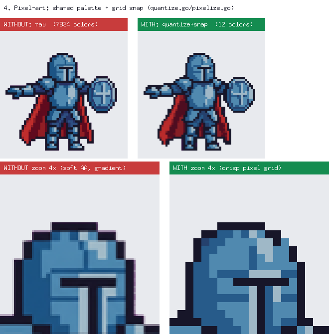

> Real generated character (bottom row is a 4× zoom crop). **WITHOUT** (raw): 7,834 colors,
> blurry edges. **WITH** (shared-palette median-cut + grid snap): 12 colors, crisp dot grid.

### Identity & quality scoring

Two orthogonal axes verify the character stays consistent: a **64-bin RGB color histogram**
(intersection similarity, leave-one-out + base comparison to catch both outlier and batch drift)
and a **dHash perceptual hash** (9×8 grayscale, structure-sensitive and color-invariant — catches
silhouette changes the histogram can't). A **motion-presence** metric catches the opposite defect
(frames too *similar* — effectively a still image). These fold into a 0–100 `ScoreFrames`:

```
start at 100
 − (35 + 10·|Found−Expected|)   frame-count accuracy (largest penalty)
 − 13·errors  − 3·warnings
 − 12   (motion < 0.01 with 2+ frames — effectively static)
 − 10   (dHash identity < 0.55 — structural collapse)
→ excellent (≥85) / good (≥70) / fair (≥50) / poor
```

### PerfectPixel vs. an ordinary AI tool

| Aspect | Ordinary AI tool | PerfectPixel |
|--------|------------------|--------------|
| Background removal | Fixed RGB chroma threshold | YCbCr chrominance matting + flood fill + morphology + self-diagnostic fallback |
| Frame segmentation | Equal split / connected-component | Projection profile + DP global-optimum cut |
| Anchor stability | Left to chance | Alpha-weighted centroid + manifest foot pivot |
| Identity consistency | Left to chance | Color histogram + dHash structural (2-axis) + regen loop |
| Quality measurement | Human eyeballing | 0–100 multi-axis score + headless regression tracking |
| Compression robustness | Fragile to JPEG noise | Luma-free chrominance space, inherently robust to 4:2:0 subsampling |

> The full deep-dive (with code references) lives in
> [`기술분석-스프라이트생성-알고리즘.md`](기술분석-스프라이트생성-알고리즘.md).

---

## Supported AI providers

Select a provider in Settings and enter the API key; it is validated, then saved to
`~/Library/Application Support/perfectpixel/config.json` (mode `0600`). Keys can also be injected
via environment variables or a `.env` file.

| Provider | Default model | API key env var |
|----------|---------------|-----------------|
| **Gemini** (default) | `gemini-3-pro-image` (Nano Banana Pro) | `GEMINI_API_KEY` / `GOOGLE_API_KEY` |
| **OpenRouter** | `google/gemini-3-pro-image-preview` | `OPENROUTER_API_KEY` |
| **fal.ai** | `fal-ai/nano-banana-pro` | `FAL_KEY` / `FAL_API_KEY` |
| **BytePlus** | `seedream-4-0-250828` (Seedream 4.0) | `BYTEPLUS_API_KEY` / `ARK_API_KEY` |

> Config-file keys take precedence over environment variables. The first provider with a key is
> auto-activated.

## Install & run

**Requirements**

- [Go](https://go.dev/dl/) 1.25+
- [Node.js](https://nodejs.org/) 18+ (frontend build)
- [Wails CLI v2](https://wails.io/docs/gettingstarted/installation):
  `go install github.com/wailsapp/wails/v2/cmd/wails@latest`
- Check platform dependencies with `wails doctor`.

**Development (HMR)**

```bash
git clone https://github.com/gykim80/perfectpixel-studio.git
cd perfectpixel-studio
./dev.sh            # or: wails dev
```

`./dev.sh` locates the wails CLI and runs `frontend/npm install` once on first launch.

**Production build**

```bash
wails build         # produces the distributable app under build/bin/
```

**API keys**

Enter keys in Settings after launch, or drop a `.env` in the project root:

```bash
cp .env.example .env   # fill in only the provider keys you use
```

## Usage

1. **Create a character** — enter a description, pick a style, generate the base character.
2. **Add motions** — choose from 100+ presets (walk, attack, …) or type your own to generate an
   animation strip.
3. **8-direction set** *(optional)* — generate a direction set from the grid; the front strip
   serves as the motion reference for other directions.
4. **Review & regenerate** — check via frame preview and animation playback, add feedback, regen.
5. **Export** — pick a folder and save engine-ready output in one pass.

## Export format

A directory named after the character is created under the chosen folder:

```
<character>/
├── sprite-sheet.png      # atlas of all state frames
├── sprite-sheet.json     # Aseprite-compatible JSON (Phaser/Unity/Godot importers)
├── manifest.json         # state / frame / FPS / loop metadata + foot pivot + per-frame trim
├── frames/<state>/       # individual frame PNGs per state
├── gif/<state>.gif       # preview GIF per state
└── apng/<state>.png      # full-alpha APNG (complements GIF's 1-bit transparency)
```

## Project structure

```
perfectpixel/
├── main.go            # Wails app entry point (window / bindings)
├── app.go             # core App methods bound to the frontend (generate / export / settings)
├── gallery.go         # gallery & image I/O App methods
├── internal/
│   ├── config/        # config persistence + .env / env fallback
│   ├── gen/           # AI providers (gemini, openrouter, fal, byteplus)
│   └── sprite/        # sprite pipeline (chroma · segment · extract · inspect · score · …)
├── cmd/ppvalidate/    # headless quality-validation harness
├── cmd/ppsamples/     # regenerates the before/after report images
├── frontend/          # React + TypeScript + Vite + Tailwind + shadcn/ui
└── build/             # Wails build resources (icons / platform config)
```

> **Why `main.go` / `app.go` / `gallery.go` sit at the root**: all three are `package main`. Wails
> requires the `App` methods exposed to the frontend to live in the root main package to generate
> bindings (`frontend/wailsjs`). `gallery.go` is an intentional split of gallery methods from
> `app.go`.

## Quality-validation harness (ppvalidate)

A CLI that drives the real generation pipeline without the GUI to collect per-category/direction
quality scores — reproducing the same 3-pass correction loop as the app.

```bash
go run ./cmd/ppvalidate -percat 1                    # 1 keyword per category
go run ./cmd/ppvalidate -keywords walk,run,attack    # specific keywords
go run ./cmd/ppvalidate -dirset walk                 # walk 8-direction set
go run ./cmd/ppvalidate -dump                         # dump preset/direction catalog as JSON
```

Requires an API key for the active provider.

## Reproducing the figures (ppsamples)

Figures 1–4 above are produced by running **real AI sprites** through the **real pipeline code**
in `internal/sprite/` — not mockups. The same input is passed through (a) a naive baseline and
(b) the actual `sprite` functions, composited side by side; the labeled numbers are measured
directly from pixel statistics.

```bash
go run ./cmd/ppsamples         # regenerate report-images/01–04 + print validation numbers
go run ./cmd/ppsamples scan    # scan sample/ strips and pick high-contrast cases
```

| Figure | Real code used | Baseline | Result (before → after) |
|--------|----------------|----------|-------------------------|
| 1 Background removal | `sprite.RemoveBackground` | RGB threshold | magenta residue 2,739 → 2px, halo 8,164 → 3,447px |
| 2 Frame segmentation | `sprite.ExtractFrames` | equal split | cut lines crossing character 8/8 → 0/8 |
| 3 Frame alignment | `sprite.ExtractFrames` | bbox center | centroid σ 27.2 → 0.2px |
| 4 Pixelization | `sprite.PixelPostProcess` | raw frames | color count 7,834 → 12 |

## Testing

```bash
go test ./...          # unit tests (live API tests in live_test.go need a key)
```

## Contributing

Issues and PRs are welcome.

1. Ensure `go build ./...`, `go vet ./...`, and `go test ./...` pass before changes.
2. Code style: `gofmt` for Go; TypeScript strict + ESLint/Prettier for the frontend.
3. New motion presets go in the `Presets` slice in `internal/sprite/presets.go` — both frontend
   and backend pick them up automatically.

## License

[MIT](LICENSE) © PerfectPixel contributors
